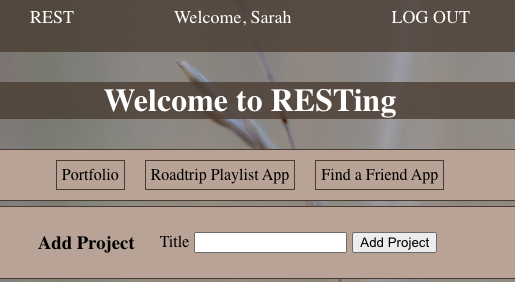

# RESTing

## Why RESTing?
* We created this application for surviving project week! We want students attending General Assembly to learn, but also take care of their mental health. This is especially true during the grueling days building up to project presentations. This application helps insert built in break times and hard stops for the work day.
* 

## Getting Started
* [Check out the site!]()
* [Whimsical](https://whimsical.com/rest-RyZUz3aycACAWjJ9LvyLzj)

## Contributors
* [Coco Kim](https://github.com/imcocokim)
* [Rachel Kinzel](https://github.com/rharen11)

## Tech Used

 

## Special Thanks:
* Ezra Jeffrey for the background image(Instagram: @ezrajeffrey)

## Ice Box
* [ ] User should be able to add specific days to their project
* [ ] User should be able to add items to each day of their project
* [ ] User should be able to delete items off each day as they are completed
* [ ] User should see built in break times and alerts to how long they are working each day
* [ ] User should be a "Total Time Spent" timer on the Project portion of their page
